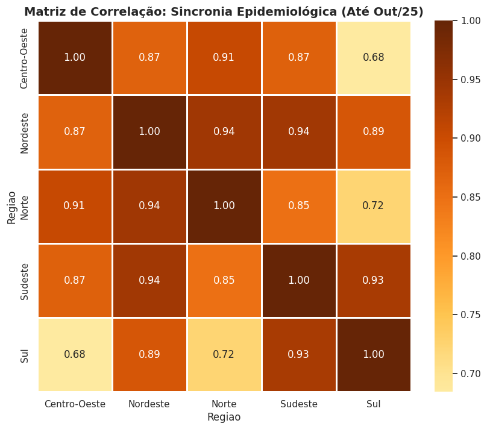
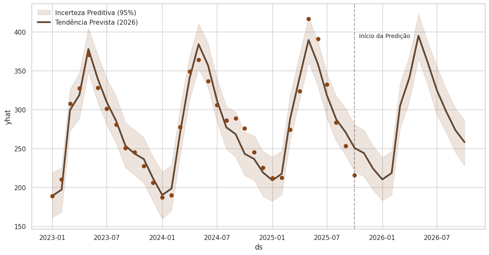
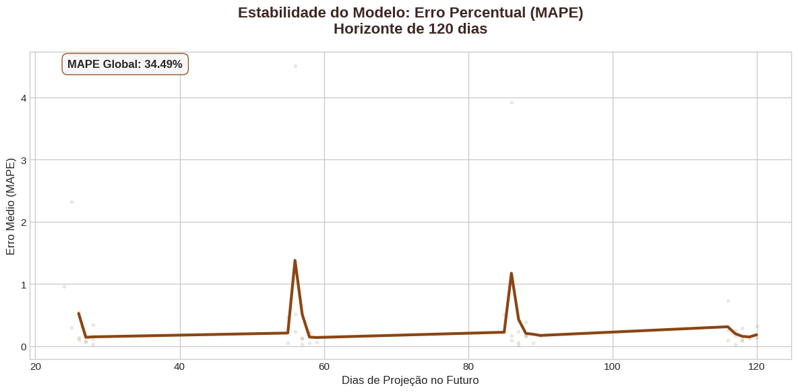

# 🩺 Respiratory Pulse: Predictive Modeling & Regional Synchrony in Brazil

## 🩺 Clinical Context
Respiratory diseases represent one of the primary drivers of hospital occupancy within the Brazilian Public Health System (SUS). Unlike chronic conditions, respiratory morbidity is highly seasonal and volatile, requiring precise forecasting for resource allocation. This project analyzes the spatiotemporal dynamics of these hospitalizations between 2023 and 2025, providing a predictive framework to anticipate surges in demand for the 2026 cycle.

## 📊 Key Analytical Insights
Regional Pulse (Synchronized Peaks): A Pearson correlation analysis revealed a coefficient above 0.90 between geographically distant regions (e.g., North and Southeast). This proves a synchronized national epidemiological heartbeat, where respiratory peaks occur simultaneously across the country, rather than in regional successions.

 

Predictive Horizon: Using the Prophet algorithm, the model successfully projected trends through October 2026. It accurately captures the annual winter peaks, allowing for a 12-month forward-looking window in healthcare management.

Performance Reliability: Through temporal cross-validation, the model maintained a MAPE (Mean Absolute Percentage Error) of 34.49%. This stability over a 120-day horizon validates the model as a robust tool for preemptive public health policy-making.

 

Data Integrity: Through temporal cross-validation, the model maintained a MAPE of 34.49%. This stability over a 120-day horizon validates the model as a robust tool for preemptive public health policy-making, even when dealing with synchronized national surges.

 

## 🛠️ Technologies & Methodology
- Language: Python 3.12
- Time-Series Modeling: Prophet: For additive modeling of seasonal trends and uncertainty intervals.
- Data Libraries: Pandas: For time-series wrangling and reporting delay filtering. Seaborn & Matplotlib: For academic-grade diagnostics and performance plots.
- Validation: Cross-Validation (Stan-based): To simulate "backtesting" and ensure model generalizability.
- Approach: Integration of regional correlation matrices with Bayesian forecasting to transform raw notifications into actionable predictive intelligence.

## 📁 Data Source
- The raw data was extracted from DATASUS (Brazilian Ministry of Health), specifically from the Hospital Information System (SIH/SUS). The analysis includes:
- Total respiratory hospitalizations categorized by state and region.
- Monthly time-series consolidation from 2023 to late 2025.
- Trend decomposition (Trend, Seasonality, and Holidays).
